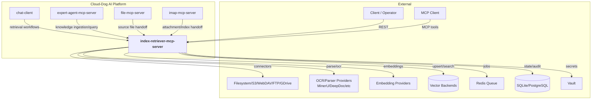
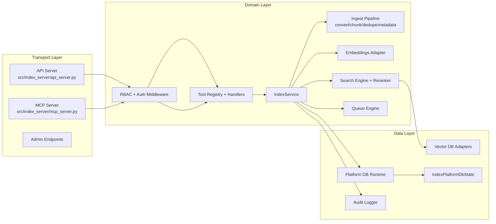
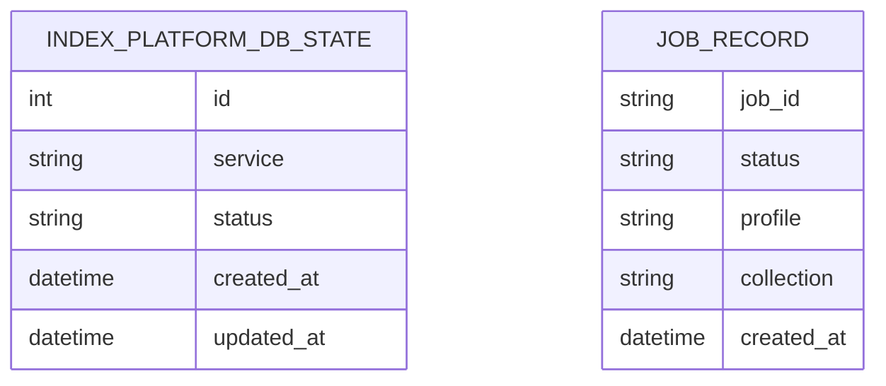
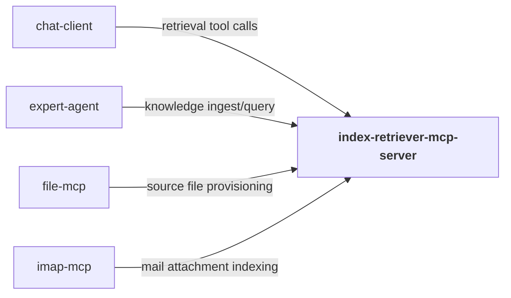
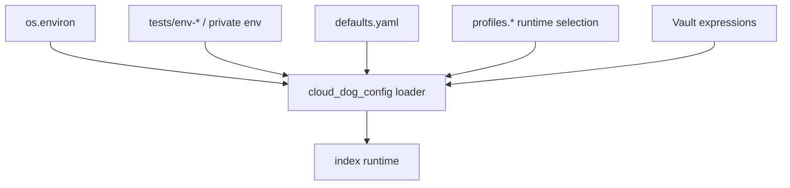
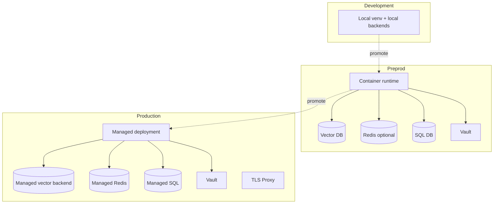
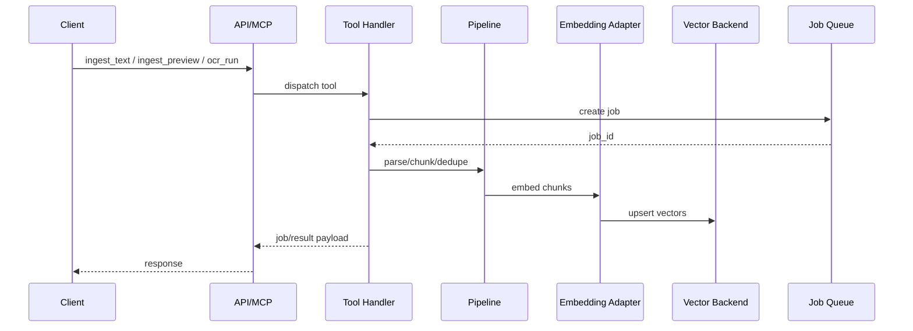
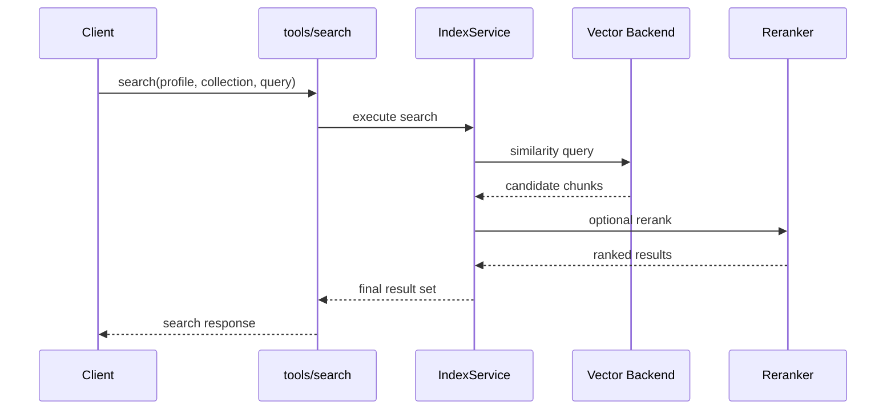

# Index Retriever MCP Server — Architecture

## 1. Overview
`index-retriever-mcp-server` provides ingestion, parsing, OCR, embedding, indexing, and retrieval services through API and MCP interfaces. It is designed for document-centric RAG workloads and supports asynchronous job-driven processing.

The service combines connector modules (filesystem/S3/WebDAV/FTP/GDrive), conversion pipelines (including OCR parsers), embedding adapters, vector backends, and search/reranking components.

It is a core platform retrieval component consumed by other services that need robust indexing and semantic search capabilities.

## 2. System Context Diagram

The service acts as the platform retrieval plane with strict ingestion/search contracts and explicit backend health instrumentation.

## 3. Component Architecture

The API and MCP layers are thin wrappers around the shared tool/service core to ensure equivalent behaviour across transports.

## 4. Module Decomposition
| Module | Path | Responsibility | Platform Package |
|---|---|---|---|
| API server | `src/index_server/api_server.py` | `/app/v1` and `/api/v1` tool routes + health | `cloud_dog_api_kit` |
| MCP server | `src/index_server/mcp_server.py` | MCP contract and tool execution bridge | `cloud_dog_api_kit` |
| Auth middleware | `src/index_server/auth/middleware.py` | API-key/JWT auth + role checks | `cloud_dog_idam` |
| Tool layer | `src/index_tools/tools/*` | Typed tool definitions and service binding | — |
| Ingestion pipeline | `src/index_tools/pipeline/*` | chunking, dedupe, metadata enrichment | — |
| Connectors | `src/index_tools/connectors/*` | source fetchers (fs/s3/webdav/ftp/gdrive/http) | — |
| Conversion/OCR | `src/index_tools/convert/*` | parser and OCR conversion pipeline | — |
| Embeddings | `src/index_tools/embeddings/*` | embedding provider abstraction | `cloud_dog_llm` |
| Vector adapters | `src/index_tools/vdb/*` | backend abstraction and capability checks | `cloud_dog_vdb` |
| Queue subsystem | `src/index_tools/queue/*` | async job engine and redis bridge | `cloud_dog_jobs` |
| DB runtime/models | `src/index_tools/db/runtime.py`, `src/index_tools/db/models.py` | DB init/health and platform table | `cloud_dog_db` |
| Config + audit | `src/index_tools/config/*`, `src/index_tools/audit/*` | config loading and audit events | `cloud_dog_config`, `cloud_dog_logging` |

## 5. Data Model

Persistent relational schema is lightweight (`index_platform_db_state`), while operational objects (job envelopes, ingestion metadata, vectors) are managed in queue and vector subsystems.

## 6. Interface Specifications
### 6.1 REST API
| Method | Path | Description | Auth |
|---|---|---|---|
| GET | `/health` | Service health + db/vdb/embedding checks | None |
| GET | `/app/v1/health` | Canonical API health | None |
| GET | `/a2a` | A2A root descriptor | API key |
| GET | `/a2a/health` | A2A health | API key |
| GET | `/app/v1/tools` | List tools | API key/JWT |
| POST | `/app/v1/tools/{tool_name}` | Execute tool | API key/JWT |
| GET | `/api/v1/tools` | Legacy tools list route | API key/JWT |
| POST | `/api/v1/tools/{tool_name}` | Legacy tool execute route | API key/JWT |

### 6.2 MCP Tools
| Tool | Description | Category |
|---|---|---|
| `profiles_list`, `profile_get` | Profile inspection | admin |
| `collections_list`, `admin_collection_create`, `admin_collection_delete` | Collection lifecycle | admin |
| `ingest_text`, `ingest_preview`, `extract_only`, `ocr_run`, `table_extract` | Ingestion/parsing/OCR workflows | ingest |
| `parsers_list`, `parser_test` | Parser diagnostics | parser |
| `search` | Semantic retrieval | search |
| `job_get`, `job_wait`, `job_list`, `job_cancel`, `job_retry`, `queue_status` | Job lifecycle | jobs |
| `backend_health_check`, `embedding_health_check` | Dependency health probes | ops |

### 6.3 A2A Endpoints
| Endpoint | Description | Protocol |
|---|---|---|
| `/a2a` | A2A root metadata | HTTP GET |
| `/a2a/health` | A2A health contract | HTTP GET |

## 7. Dependencies & External Services
### 7.1 Platform Packages
| Package | Version | Usage in this project |
|---|---|---|
| `cloud_dog_config` | `>=0.1.0` | Config loading and profile models |
| `cloud_dog_logging` | `>=0.1.0` | Structured logging and audit |
| `cloud_dog_api_kit` | `>=0.1.0` | API app creation and protocol helpers |
| `cloud_dog_idam` | `>=0.1.0` | Auth middleware |
| `cloud_dog_jobs` | `>=0.1.0` | Queue and async job semantics |
| `cloud_dog_db` | `>=0.1.0` | DB runtime integration |
| `cloud_dog_llm` | `>=0.1.0` | Embedding provider integration |
| `cloud_dog_vdb` | `>=0.5.0` | Vector backend abstraction |

### 7.2 External Services
| Service | Purpose | Connection | Vault Path |
|---|---|---|---|
| File/connectors | Input acquisition | connector profile config | `dev.storage.*` |
| OCR/parse services | Text extraction | converter config | `dev.parsers.*` |
| Embedding providers | Vector generation | embeddings config | `dev.models.*` |
| Vector DB backend | Index storage/search | backend config | `dev.vector.*` |
| Redis | Job queue (optional) | queue redis config | `dev.redis.*` |
| SQL database | platform state | db config | `dev.databases.*` |
| Vault | secret/config | env + vault runtime | `secret/*` |

### 7.3 Cross-Project Dependencies

## 8. Configuration Architecture

Configuration roots include `server`, `auth`, `storage`, `queue`, `profiles`, and `rbac` with profile-specific ingestion/embedding/vector settings.

## 9. Security Architecture
- Authentication: API-key/JWT middleware for API and MCP tool routes.
- Authorisation: role checks (`reader/writer/maintainer/admin`) per tool/action.
- Secrets: connector and model credentials loaded via env/config/Vault.
- Audit: dedicated API/MCP audit logs and tool-level event metadata.
- Network: health and tool endpoints with canonical and legacy route compatibility.

## 10. Deployment Architecture

## 11. Key Flows
### 11.1 Ingestion and Indexing Flow

### 11.2 Search Flow

## 12. Non-Functional Characteristics
| Characteristic | Approach |
|---|---|
| Scalability | Async job pipeline and pluggable backend architecture |
| Reliability | Tool-level health checks and explicit job lifecycle controls |
| Observability | API/MCP audit logs, backend probes, queue status endpoints |
| Performance | Chunking/dedupe/embedding pipeline with backend-specific tuning |
| Maintainability | Clear separation between server adapters and reusable `index_tools` library |
