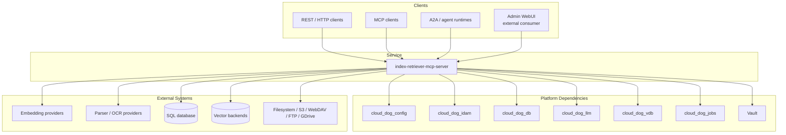
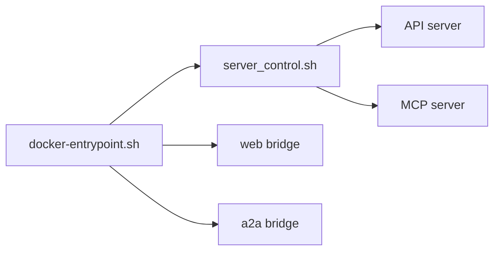
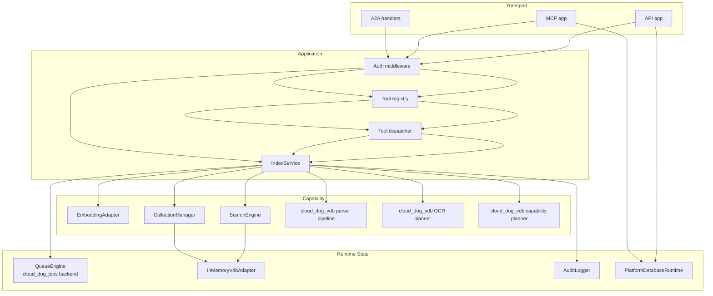
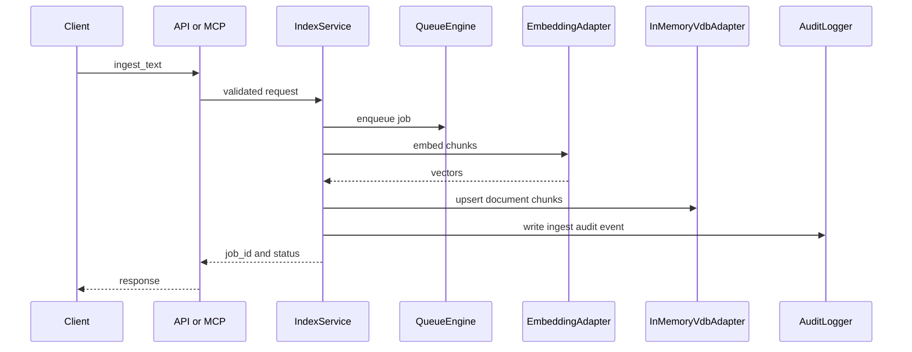

# Index Retriever MCP Server Architecture

## Provenance
- Canonical architecture for index-retriever-mcp-server. Role references reconciled to `ROLES-AND-USECASES.md §1` by W28A-749 (IDAM Thread-b).
- Source basis: `defaults.yaml`, the API/Web/MCP/A2A servers, and the runtime tool registry (92 tools).

## 1. Purpose

`index-retriever-mcp-server` is the retrieval and indexing service for Cloud-Dog agent workflows. It exposes the same core capability set through:

- an HTTP API, which is the canonical integration surface,
- an MCP tool interface for agent-to-agent and tool-calling runtimes,
- A2A-compatible endpoints for platform interoperability,
- an Admin WebUI served by this runtime that consumes the HTTP API only.

The service owns the transport contracts, authentication and authorisation boundaries, tool catalogue, ingest and retrieval orchestration, audit hooks, and lightweight platform database state. It also delegates parser, OCR, table-extraction, and backend-capability planning to platform packages where appropriate.

This document is written for external technical users. It describes the delivered architecture in this repository as implemented and test-backed, not only the broader requirement intent.

## 2. Scope and Reader Guidance

This repository delivers and documents:

- API, MCP, and A2A runtime surfaces,
- a shared tool and service layer used by all transports,
- profile and collection administration,
- text ingestion, reference ingestion, search, retrieval, preview, OCR planning, table extraction, retention, and reindex operations,
- Vault-aware configuration loading,
- database initialisation and health checks,
- audit event emission,
- an in-repo admin WebUI under `/admin/ui/*`,
- containerised all-in-one runtime packaging.

This repository ships a lightweight Admin WebUI for profile, user, group, and API-key administration. The WebUI is intentionally thin and acts as a strict HTTP API client. It does not access DB, VDB, queue, or backend providers directly.

## 3. Architecture Summary

At a high level, the service is split into four layers:

1. **Transport layer**
   - FastAPI-based HTTP API
   - MCP server and MCP tool contract registration
   - A2A-compatible endpoints

2. **Application layer**
   - `IndexService` as the central orchestration facade
   - tool registry and transport-independent tool execution
   - RBAC enforcement and request shaping

3. **Capability layer**
   - parsing, OCR, and table extraction delegation through `cloud_dog_vdb`
   - embedding delegation through `cloud_dog_llm`
   - configuration through `cloud_dog_config`
   - database runtime through `cloud_dog_db`

4. **Runtime state layer**
   - lightweight service-owned relational state
   - `cloud_dog_jobs` managed queue state
   - in-process vector storage fallback
   - append-only audit logging

The most important architectural detail for external users is this:

- The **public contracts are stable and multi-backend aware**.
- The **core in-repo runtime path currently uses an in-memory VDB adapter and a persisted `cloud_dog_jobs` queue backend** for deterministic local and test behaviour.
- The **parser, OCR, table, and capability-planning paths are already delegated to platform packages and are validated against live matrices in the test suite**.

## 4. System Context

## 5. Runtime Topology

### 5.1 Transport topology

The runtime exposes these logical surfaces:

| Surface | Canonical path | Primary code |
|---|---|---|
| API | `/api/v1` | `src/index_server/api_server.py` |
| MCP | `/mcp` | `src/index_server/mcp_server.py` |
| A2A | `/a2a` | `src/index_server/api_server.py` |
| A2A (standalone) | `/a2a` | `src/index_server/a2a_server.py` (reuses API app) |
| Web | `/` (SPA + proxy) | `src/index_server/web_server.py` |
| Admin API | `/admin/*` | `src/index_server/api_server.py` |
| Admin UI (legacy) | `/admin/ui/*` | `src/index_server/api_server.py` |
| Health | `/health`, `/ready`, `/live`, `/api/v1/health` | `src/index_server/api_server.py` |

The MCP runtime is registered through `cloud_dog_api_kit.register_mcp_contract(...)`, with legacy tools alias support enabled for compatibility.

### 5.2 All-in-one container topology

The default container packaging starts API and MCP services and optionally bridges additional ports:

- API port: `CLOUD_DOG__INDEX__API_SERVER__PORT`
- MCP port: `CLOUD_DOG__INDEX__MCP_SERVER__PORT`
- Web compatibility port: `CLOUD_DOG__INDEX__WEB_SERVER__PORT`
- A2A compatibility port: `CLOUD_DOG__INDEX__A2A_SERVER__PORT`

In the all-in-one image, `docker-entrypoint.sh` can start compatibility TCP bridges:

- Web port -> API port
- A2A port -> API port

This gives stable external ports without duplicating application servers.

### 5.3 Runtime process view

## 6. Component Decomposition

### 6.1 Transport layer

The transport layer is intentionally thin:

- `src/index_server/api_server.py` builds the HTTP API and A2A endpoints.
- `src/index_server/mcp_server.py` builds the MCP server and registers tool contracts.
- Both surfaces route into the same `IndexService` and tool registry, so API and MCP behaviour stay aligned.

### 6.2 Shared tool layer

`src/index_tools/tools/registry.py` defines a schema-first tool registry. Each tool publishes:

- name,
- description,
- handler name,
- input JSON schema,
- output JSON schema.

This registry is used by both API and MCP surfaces, which is why the same tool set is available across transports.

### 6.3 Service layer

`src/index_tools/tools/service.py` is the main application facade. It owns:

- profile and collection operations,
- ingest orchestration,
- search and retrieval,
- parser and OCR helper flows,
- stream session ingestion,
- job inspection and retry hooks,
- retention and reindex actions,
- dependency health reporting.

### 6.4 Metadata uplift boundary and control-plane contract

The metadata uplift introduces a stricter ownership boundary between this service and `cloud_dog_vdb`.

#### 6.4.1 Ownership split

`index-retriever-mcp-server` owns:

- transport contracts for HTTP, MCP, A2A, and Admin WebUI,
- authentication, RBAC enforcement, and audit entry points,
- profile and collection selection,
- job creation, progress reporting, and orchestration,
- caller attribution inputs such as actor, app, user, and session context,
- response shaping and compatibility aliases for API and MCP callers.

`cloud_dog_vdb` owns:

- canonical metadata schema and validation,
- deterministic identity helpers for `doc_id`, `record_id`, content/source hashes, and chunk lineage,
- parser, OCR, table extraction, and chunk-provenance normalization,
- backend-portable metadata filter planning and lifecycle helpers,
- backend adapter writes and reads for record metadata persistence.

Current implementation note:

- some legacy service ingest paths still populate metadata defaults and generate UUID-based document identifiers locally,
- this is a transition gap, not the intended long-term ownership model for the uplift.

#### 6.4.2 Forbidden duplication list

The service MUST NOT permanently duplicate package-owned logic for:

- canonical metadata required-field validation,
- deterministic ID generation rules,
- source/content hash computation rules once package helpers exist,
- parser/OCR/table provenance schema design,
- backend-specific metadata filter translation,
- lifecycle transition semantics for `active`, `superseded`, `deleted`, and `archived`,
- retention-field interpretation and purge-candidate selection.

The package MUST NOT take ownership of service concerns such as:

- transport authentication and RBAC decisions,
- API/MCP/A2A route registration and response envelopes,
- job/audit correlation IDs,
- profile CRUD and service runtime configuration persistence,
- WebUI-facing compatibility aliases or service-local request contracts.

#### 6.4.3 Control-plane integration model

The service-to-package hand-off is a control-plane contract:

- service passes in:
  - resolved `profile` and `collection`,
  - source payload or source reference,
  - actor and caller context (`app_id`, `user_id`, `session_id`) when available,
  - parser/OCR/chunking options,
  - retention and dedupe intent,
  - explicit metadata overrides that are additive rather than schema-defining;
- package returns:
  - validated canonical metadata per record,
  - deterministic identifiers and lineage fields,
  - parser/OCR/table provenance,
  - backend write/read results,
  - lifecycle and filter semantics that are portable across supported adapters.

This means the service is the policy and transport entry point, while `cloud_dog_vdb` is the canonical metadata and vector-operation execution plane.

### 6.5 Source Module Directory

The `src/` tree contains two top-level packages. The complete directory listing is:

#### `src/index_server/` -- Transport and runtime layer

| Module | Purpose |
|---|---|
| `api_server.py` | HTTP API app builder; all API, admin, A2A, auth, and SPA routes |
| `a2a_server.py` | A2A server entrypoint (reuses the API app) |
| `mcp_server.py` | MCP server and tool contract registration |
| `web_server.py` | Thin web server for SPA delivery and API proxy |
| `main.py` | CLI entrypoint for starting servers |
| `runtime_config.py` | Server binding and port resolution |
| `logging_runtime.py` | Platform logging initialisation |
| `streaming.py` | Stream session ingest helpers |
| `admin_ui.py` | Legacy admin UI HTML/JS/CSS generators |
| `admin/` | Admin sub-package (`endpoints.py`) |
| `auth/` | Auth sub-package (`middleware.py` -- AuthMiddleware, AuthResult) |

#### `src/index_tools/` -- Application, capability, and state layer

| Module | Purpose |
|---|---|
| `tools/` | Tool registry, definitions, handlers, and `IndexService` facade |
| `config/` | Configuration loader and typed config models |
| `db/` | Platform database runtime, ORM models, migrations |
| `collections/` | Collection manager and collection schema |
| `search/` | Search engine and reranker |
| `embeddings/` | Embedding adapter and provider registry |
| `vdb/` | Vector database adapters (InMemoryVdbAdapter) and VDB registry |
| `pipeline/` | Ingest pipeline: chunking, deduplication, metadata shaping |
| `queue/` | Queue engine, job models, Redis bridge |
| `audit/` | Audit logger and audit event definitions |
| `connectors/` | Source connectors: filesystem, S3, WebDAV, FTP, HTTP, Google Drive |
| `convert/` | Document converters: PDF, Office, Pandoc, DeepDoc, MinerU |
| `lifecycle/` | Document lifecycle and retention logic |
| `security/` | RBAC enforcement and scope resolution |

## 7. Transport Contracts

### 7.1 HTTP API

The HTTP API is the canonical surface for external integrations and the Admin WebUI.

The full route inventory is maintained in `docs/API-REFERENCE.md`. Key route groups are summarised below:

| Group | Methods | Paths | Purpose |
|---|---|---|---|
| Auth | POST, GET | `/auth/login`, `/auth/me`, `/auth/logout` | Session authentication |
| Health | GET | `/health`, `/ready`, `/live` | Platform health probes (DB, VDB, embedding) |
| Status | GET | `/status`, `/api/status` | Runtime status metrics |
| Logs | GET | `/api/logs`, `/api/config-events`, `/api/audit-log` | Observability and audit log access |
| API health | GET | `/api/v1/health` | Per-surface health |
| A2A | GET | `/a2a`, `/a2a/health`, `/a2a/events` | A2A service descriptor and health |
| A2A agent | GET, POST | `/.well-known/agent.json`, `/tasks`, `/a2a/tasks` | A2A agent card and task submission |
| Tools | GET, POST | `/api/v1/tools`, `/api/v1/tools/{tool_name}` | Tool catalogue and execution |
| Upload | POST | `/api/v1/upload` | Multipart file upload ingestion |
| Admin profiles | GET, POST, PUT, DELETE | `/admin/profiles`, `/admin/profiles/{id}` | Profile CRUD |
| Admin users | GET, POST, PUT, DELETE | `/admin/users`, `/admin/users/{id}` | User CRUD |
| Admin groups | GET, POST, PUT, DELETE | `/admin/groups`, `/admin/groups/{id}` | Group CRUD |
| Admin API keys | GET, POST, DELETE | `/admin/api-keys`, `/admin/api-keys/{id}` | API key management |
| Admin collections | GET, POST, PUT, DELETE | `/admin/collections`, `/admin/collections/{id}` | Collection CRUD |
| Admin sources | GET, POST, PUT, DELETE | `/admin/source-configs`, `/admin/source-configs/{id}` | Source configuration CRUD |
| Admin RBAC | GET, POST, DELETE | `/admin/rbac-bindings`, `/admin/rbac-bindings/{type}/{id}/{role}` | RBAC binding management |
| Admin UI | GET | `/admin/ui`, `/admin/ui/profiles`, `/admin/ui/security`, `/admin/ui/app.js`, `/admin/ui/styles.css` | Legacy admin UI pages |
| SPA | GET | `/runtime-config.js`, `/`, `/{path:path}` | SPA delivery and client routing |

Total API server route registrations: 67+.

Health payloads include:

- overall status,
- correlation ID,
- database probe,
- vector backend health,
- embedding health.

### 7.2 MCP

The MCP runtime is built from the same tool registry. It exposes:

- `GET /health`
- canonical MCP tool contract at `/mcp`
- canonical MCP catalogue at `/mcp/tools`
- legacy alias support through the platform contract registration layer

Each tool call is authenticated and then dispatched through the same `execute_tool(...)` path used by the API.

### 7.3 A2A

The A2A surface is an authenticated HTTP contract with agent card and task submission:

- `GET /a2a` -- A2A service descriptor (API-key auth required)
- `GET /a2a/health` -- A2A health (API-key auth required)
- `GET /a2a/events` -- configuration change events (API-key auth required)
- `GET /.well-known/agent.json` -- A2A agent card (skills: ingest_text, search, retrieve)
- `POST /tasks` -- submit A2A task
- `POST /a2a/tasks` -- submit A2A task (prefixed path)

`/a2a/health` enforces the shared API-key authority and is expected to return:

- `401` without valid credentials,
- `200` with a valid API key supplied either as `X-API-Key` or `Authorization: Bearer <api-key>`.

### 7.4 Web Server

The web server (`web_server.py`) is a thin SPA delivery and API proxy surface:

- `GET /health`, `GET /status` -- web surface health and status
- `GET /runtime-config.js` -- SPA runtime config bootstrap
- `ALL /webapi/proxy/{path}`, `ALL /api/{path}`, `ALL /app/{path}` -- API proxy routes
- `ALL /admin/{path}` -- admin proxy (non-SPA admin paths)
- `GET,POST /auth/{path}` -- auth proxy
- `GET /openapi.json`, `GET /docs`, `GET /redoc` -- documentation proxy
- `GET /admin`, `/admin/users`, `/admin/groups`, `/admin/api-keys`, `/admin/rbac` -- SPA admin routes
- `GET /`, `GET /{path}` -- SPA entrypoint and fallback

Total web server route registrations: 19.

### 7.5 Tool catalogue and execution coverage

The shared tool registry publishes the service catalogue and JSON schemas for both API and MCP clients.

The registry currently advertises these tool families:

- profile and collection tools,
- ingest and stream tools,
- parser, preview, OCR, and table tools,
- search and retrieval tools,
- job and queue tools,
- maintenance and health tools.

Concrete dispatcher paths are implemented today for:

- `profiles_list`
- `profile_get`
- `collections_list`
- `admin_collection_create`
- `admin_collection_delete`
- `ingest_text`
- `parsers_list`
- `parser_test`
- `ingest_preview`
- `extract_only`
- `ocr_run`
- `table_extract`
- `search`
- `job_get`
- `job_wait`
- `job_list`
- `job_cancel`
- `job_retry`
- `backend_health_check`
- `embedding_health_check`
- `queue_status`

The registry also contains compatibility-facing names beyond that concrete dispatch subset. External users should therefore treat the tool catalogue as the declared contract surface, but validate any operation they depend on against the corresponding test coverage and current runtime behaviour.

## 8. Authentication, Authorisation, and Audit

### 8.1 Authentication

Authentication is handled by `src/index_server/auth/middleware.py`.

Delivered behaviour:

- API keys are loaded from `CLOUD_DOG__INDEX__AUTH__API_KEYS`.
- `TEST_A2A_API_KEY` is also supported for strict A2A contract tests.
- API keys are accepted from either:
  - `X-API-Key`
  - `Authorization: Bearer <api-key>`
- Local fixed bearer tokens are supported for deterministic role tests:
  - `valid-reader-token`
  - `valid-writer-token`
  - `valid-admin-token`

When the platform identity package is available, auth health reports `cloud_dog_idam`; otherwise the local fallback path reports `fallback`.

### 8.2 Authorisation

The role model enforced across transports is:

- `reader`
- `writer`
- `maintainer`
- `admin`

Authorisation is enforced:

- per transport request,
- per tool category,
- and, where configured, per collection through collection ACL checks.

Examples:

- admin tools require `admin`,
- ingest tools require `writer`, `maintainer`, or `admin`,
- parser test, OCR, and table extraction require `maintainer` or `admin`,
- search and retrieve are available to `reader` and above.

### 8.3 Audit

Audit events are emitted through `AuditLogger`. API and MCP can use separate audit paths resolved from environment configuration:

- `CLOUD_DOG__INDEX__API_AUDIT_PATH`
- `CLOUD_DOG__INDEX__MCP_AUDIT_PATH`
- `CLOUD_DOG__INDEX__STORAGE__AUDIT__PATH`
- `AUDIT_LOG_PATH`

The architecture guarantees that transport entry points pass actor identity into service operations so audit events can capture the caller.

## 9. Data and State Model

### 9.1 Database-owned state

This repository owns a lightweight relational schema through `cloud_dog_db` migrations.

Current service-owned ORM model:

- `IndexPlatformDbState`

This table proves service schema ownership and supports database startup and migration verification. It should be understood as platform runtime state, not as the primary document store.

### 9.2 In-memory operational state

The current in-repo service runtime holds several operational structures in memory:

- collections and documents in `InMemoryVdbAdapter`,
- jobs in `QueueEngine`,
- profile definitions in `IndexService.profiles`,
- collection ACLs in `IndexService.collection_roles`,
- stream sessions in `IndexService.stream_sessions`,
- ingested document records in `IndexService.documents`,
- idempotency keys in `IndexService.idempotency`.

This is a deliberate implementation boundary today and should be factored into deployment expectations.

### 9.3 Database runtime integration

`src/index_tools/db/runtime.py` provides:

- environment-driven SQL settings resolution,
- sync-driver normalisation for async DSNs,
- automatic migration execution from `database/migrations/cloud_dog_db`,
- connection health probing,
- engine lifecycle management.

Default local persistence uses SQLite at `./data/index_retriever.db` unless overridden by environment variables.

## 10. Ingestion and Retrieval Architecture

### 10.1 Standard ingest path

For `ingest_text`, the main runtime flow is:

1. validate profile,
2. ensure collection exists,
3. generate an idempotency key,
4. create a job record,
5. chunk input text with `token_chunks`,
6. generate embeddings through `EmbeddingAdapter`,
7. upsert chunks into `InMemoryVdbAdapter`,
8. persist an in-memory `DocumentRecord`,
9. write audit events,
10. mark the in-process job complete.

### 10.2 Reference ingest path

`ingest_reference` currently reads a local path and reuses the text-ingest path. Connector modules for filesystem, S3, WebDAV, FTP, HTTP, and Google Drive exist in the repository and are unit-tested, but the primary service method in this repository currently implements local-path reference ingestion directly.

This distinction matters for external users:

- connector capability exists at module level,
- contract and configuration support exists in requirements and tests,
- the delivered main service path for `ingest_reference` is still the simpler local-path implementation.

### 10.3 Canonical metadata flow

The target metadata flow for the uplift is:

1. the service resolves transport identity, profile, collection, and request options;
2. the service passes those control-plane inputs into `cloud_dog_vdb`;
3. `cloud_dog_vdb` computes or validates canonical metadata and record identities;
4. backend adapters persist and query records using that canonical metadata model;
5. the service formats response payloads for API or MCP callers without redefining canonical field semantics.

Until the uplift is completed, some legacy service-core paths still perform local metadata shaping. Those paths should be treated as temporary compatibility behaviour and not as the final architecture boundary.

### 10.3 Search and retrieval path

The search path uses two steps:

1. build a backend capability plan through `cloud_dog_vdb` when available,
2. execute the actual query through `SearchEngine`, which currently uses `InMemoryVdbAdapter`.

Current query scoring in the in-memory adapter is overlap-based text scoring over stored chunks, not a live remote vector query.

`retrieve` returns the stored document text and metadata from the in-memory document map.

### 10.4 Stream ingest path

Streaming helpers in `src/index_server/streaming.py` expose the session lifecycle:

- `ingest_stream_open`
- `ingest_stream_event`
- `ingest_stream_close`

The service keeps per-session stream state in memory and turns each event into the same underlying ingest flow used for text ingestion.

### 10.5 Maintenance operations

The service also exposes:

- `delete_by_id`
- `delete_by_filter`
- `retention_run`
- `reindex_run`

These operate against the same runtime document and collection state used by the current service implementation.

## 11. Parser, OCR, and Table-Extraction Architecture

### 11.1 Delegation model

Parser and OCR flows are intentionally delegated to `cloud_dog_vdb` rather than being hard-coded in the service.

The service uses platform package entry points for:

- parser registry construction,
- ingestion preview,
- extract-only flows,
- OCR planner decisions,
- table extraction flows,
- backend capability planning.

This means the parsing plane is already externalised even though the primary search runtime in this repository is still local and in-process.

### 11.2 Delivered parser-facing operations

The main parser-facing tools are:

- `parsers_list`
- `parser_test`
- `ingest_preview`
- `extract_only`
- `ocr_run`
- `table_extract`

These operations let external users:

- discover parser providers,
- validate parser health,
- preview chunking and extraction results before indexing,
- evaluate OCR decisions,
- extract table structures without full ingestion.

### 11.3 Verified parser provider matrix

The test plan defines and exercises parser-provider coverage for:

- DeepDoc
- Docling
- MinerU
- Marker MCP
- Transformers
- Internal

The corresponding integration suites are `IT2.7` through `IT2.12`, with OCR matrix coverage in `IT2.13` and table extraction matrix coverage in `IT2.14`.

## 12. Vector Backend and Embedding Architecture

### 12.1 Current runtime behaviour

Within this repository, the main `IndexService` currently writes and queries through `InMemoryVdbAdapter`.

That adapter provides:

- collection creation and deletion,
- chunk upsert,
- metadata filter matching,
- simple overlap-based query scoring,
- embedding dimension consistency validation,
- lightweight health reporting.

This is the current service-core runtime path.

### 12.2 Backend capability model

The broader backend model is defined through `cloud_dog_vdb` capability descriptors and planning. The repository’s requirements and tests validate cross-backend expectations even when the default local runtime path remains in-process.

Backends covered by the contract and integration matrix are:

- Chroma
- Qdrant
- OpenSearch
- PGVector
- Weaviate
- Infinity

Relevant suites include:

- `CT1.1` to `CT1.4`
- `IT2.1` to `IT2.6`
- `AT2.1`, `AT2.2`, `AT2.5`
- `PT1.1`, `PT1.2`

### 12.3 Embedding architecture

Embeddings are produced through `EmbeddingAdapter`, which delegates to `cloud_dog_llm` when available.

Provider configuration is controlled by:

- `CLOUD_DOG__INDEX__EMBEDDING__PROVIDER`
- `CLOUD_DOG__INDEX__EMBEDDING__MODEL`

If the platform package is not available, a deterministic local fallback embedding is generated from a SHA-256 digest. This fallback exists for deterministic local and test behaviour and should not be treated as the target production embedding path.

The multi-model application matrix covers:

- BGE
- Nomic
- Granite

through `AT2.4`.

## 13. Queue and Job Architecture

`QueueEngine` now fronts the persisted `cloud_dog_jobs` backend used by the service core.

Delivered behaviour:

- job enqueue,
- job lookup,
- job listing,
- managed execution against SQL or Redis queue storage,
- worker identity via `server_id`,
- timeout and retry handling,
- idempotency key generation.

The service still drains the queue inline for deterministic local execution, but the job state itself is persisted through `cloud_dog_jobs` and survives process hand-off.

For external users, this means:

- the API and tool contracts for jobs are stable,
- the current default runtime is single-service but queue-persistent,
- queue semantics can evolve behind the same external tool contract.

## 14. Configuration and Secret Resolution

Configuration is loaded through `cloud_dog_config.load_config(...)` in `src/index_tools/config/loader.py`.

Documented precedence is:

1. `os.environ`
2. `.env` or explicit env files
3. `config.yaml`
4. `defaults.yaml`
5. Vault-backed resolution

This repository expects runtime configuration to converge into a single typed `GlobalConfig`.

Important characteristics:

- Vault resolution is supported by the canonical loader path.
- unresolved values can be treated strictly,
- backward-compatible merge logic exists for direct unit-test layer injection,
- runtime code should read from environment-driven or loaded configuration, not hard-coded values.

## 15. Deployment Model

### 15.1 Local and test tiers

The project ships a large environment and test harness set for:

- UT
- ST
- IT
- AT
- PT
- local Docker all-in-one runtime

These harnesses are used to validate:

- route contracts,
- auth contracts,
- parser/provider matrices,
- backend matrices,
- database startup and migration,
- end-to-end ingest and search flows.

### 15.2 Pre-production and production

For external deployments, the intended topology is:

- this service container,
- SQL database,
- embedding provider,
- parser and OCR providers as required,
- one or more configured vector backends,
- Vault or equivalent secret source.

The shipped `env-docker-example` and container entrypoint provide the all-in-one runtime baseline, while host-network or explicit port publishing can be layered around it at deployment time.

## 16. Verification and Traceability

The architecture described here is backed by three inputs:

1. requirements in `REQUIREMENTS.md`,
2. implementation in `src/`,
3. tiered verification in `TESTS.md` and `tests/`.

Examples of test-backed architecture claims:

| Capability | Evidence |
|---|---|
| canonical API and MCP route contract | `IT1.1` to `IT1.18`, route-prefix strict runs in `TESTS.md` |
| A2A auth parity | `IT1.18`, `UT1.38`, W14B strict evidence in `TESTS.md` |
| admin WebUI API-only CRUD path | `AT1.10`, `IT1.22`, `UT1.44` |
| DB startup and migration | `ST1.14`, `IT2.15` |
| parser provider matrix | `IT2.7` to `IT2.14`, `AT2.3`, `PT1.3` |
| six-backend VDB matrix | `CT1.1` to `CT1.4`, `IT2.1` to `IT2.6`, `AT2.1`, `AT2.2`, `AT2.5` |
| multi-embedding model verification | `AT2.4` |
| tool schema and dispatch integrity | `UT1.29`, `UT1.37`, `UT1.40` |

## 17. Current Implementation Boundaries

External users should be aware of the following current boundaries:

1. The packaged Admin WebUI currently covers profile, user, group, and API-key administration. Broader observability and document workflow screens remain outside this in-repo UI surface.
2. The current service-core indexing and search path uses `InMemoryVdbAdapter`, not a live remote VDB client inside `IndexService`.
3. The current service-core queue path persists jobs through `cloud_dog_jobs` and drains them inline through `QueueEngine`; it is not yet a separate long-running worker deployment.
4. `ingest_reference` currently handles local path references directly; connector modules exist separately and are not yet the sole orchestrated path inside `IndexService`.
5. The relational schema owned by this repository is intentionally small and does not currently act as the primary document or job store.

These are implementation facts, not documentation gaps. They should be used to plan deployment and integration expectations correctly.

## 18. External Integration Guidance

For external integrators, the recommended stable integration choices are:

- use the HTTP API under `/api/v1` as the primary contract,
- use `/mcp` when integrating from MCP-aware clients,
- use `/a2a` only when you need agent interoperability contracts,
- rely on the tool catalogue rather than transport-specific custom paths,
- treat parser and backend selection as configuration concerns,
- validate target parser and backend combinations with the corresponding IT and AT suites before promotion.

## 19. Source of Truth

When this document and code appear to differ, the source-of-truth order is:

1. transport and service implementation in `src/`,
2. requirement obligations in `REQUIREMENTS.md`,
3. test-backed verified behaviour in `tests/` and `TESTS.md`,
4. this document.

This document has been updated to match that source-of-truth order.
